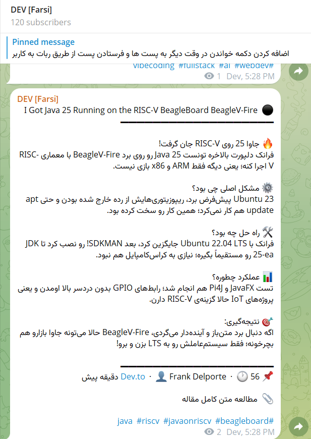
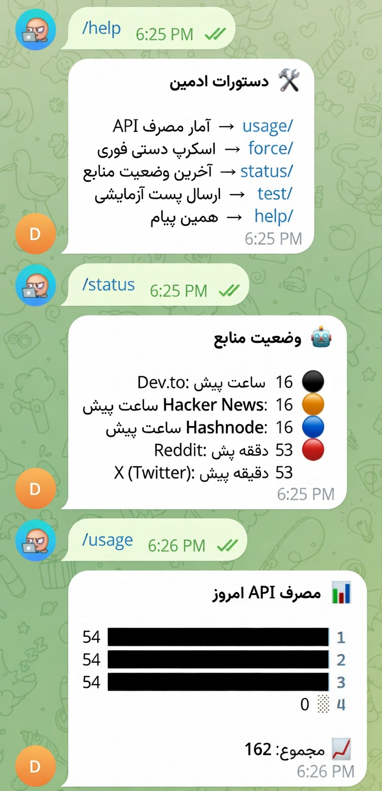

<div dir="rtl">

# 🤖 DevTofa - تلگرام بات اخبار تکنولوژی

**نسخه فعلی: v1.2**

[](https://workers.cloudflare.com/)
[](https://t.me/DevTofa)
[](https://groq.com/)
[](https://developer.mozilla.org/en-US/docs/Web/JavaScript)

<p align="center">
  <b>ربات هوشمند جمع‌آوری و خلاصه‌سازی اخبار تکنولوژی با هوش مصنوعی</b>
</p>

<p align="center">
  <a href="https://t.me/DevTofa">🚀 مشاهده کانال تلگرام</a>
</p>

---

## 📋 فهرست مطالب

- [معرفی](#معرفی)
- [تاریخچه نسخه‌ها](#تاریخچه-نسخهها)
- [ویژگی‌ها](#ویژگیها)
- [هزینه‌ها و محدودیت‌های رایگان](#هزینهها-و-محدودیتهای-رایگان)
- [معماری سیستم](#معماری-سیستم)
- [نصب و راه‌اندازی](#نصب-و-راهاندازی)
- [دستورات ادمین](#دستورات-ادمین)
- [تنظیمات Cron](#تنظیمات-cron)
- [اسکرین‌شات‌ها از کانال](#اسکرینشاتها-از-کانال)
- [نمونه کد](#نمونه-کد)
- [پشتیبانی](#پشتیبانی)

---

## 📜 تاریخچه نسخه‌ها

### v1.2 (آخرین نسخه) 🆕

**تاریخ انتشار:** 2/13/2026

**تغییرات:**
- ✅ **اضافه شدن منبع Hacker News** - اخبار برتر تکنولوژی از هکر نیوز
- ✅ **اضافه شدن منبع Hashnode** - مقالات فنی از پلتفرم Hashnode
- ✅ **بهبود فرمت فارسی** - استفاده از RLM برای نمایش بهتر راست‌به‌چپ
- ✅ **فیلتر محتوای هوشمند** - تشخیص خودکار پست‌های غیرتکنولوژیک
- ✅ **پشتیبانی از ایموجی‌های منبع** - هر منبع با آیکون و رنگ مخصوص

### v1.1
- اضافه شدن Reddit
- اضافه شدن X (Twitter)
- سیستم روتیشن API Key

### v1.0
- راه‌اندازی اولیه
- پشتیبانی از Dev.to
- اتصال به Groq AI

---

## 🎯 معرفی

**DevTofa** یک ربات تلگرام هوشمند است که اخبار تکنولوژی را از ۵ منبع معتبر جمع‌آوری کرده، با استفاده از هوش مصنوعی **Kimi K2** خلاصه‌سازی می‌کند و به زبان فارسی در کانال تلگرام منتشر می‌کند.

> 📝 **نوشته شده با:** JavaScript (ES Modules)  
> 🚀 **اجرا روی:** Cloudflare Workers Edge Runtime

### 🔗 لینک کانال فعال
📢 **https://t.me/DevTofa**

---

## ✨ ویژگی‌ها

### 📰 منابع خبری
| منبع | آیکون | توضیحات |
|------|-------|---------|
| **Dev.to** | ⚫ | مقالات توسعه‌دهندگان |
| **Hacker News** | 🟠 | اخبار برتر تکنولوژی |
| **Hashnode** | 🔵 | وبلاگ‌های فنی |
| **Reddit** | 🔴 | پست‌های r/programming, r/technology, r/webdev |
| **X (Twitter)** | 𝕏 | توییت‌های #programming و #javascript |

### 🤖 هوش مصنوعی
- **مدل:** `moonshotai/kimi-k2-instruct-0905` از Groq
- **خلاصه‌سازی هوشمند** محتوا به زبان فارسی روان
- **تشخیص خودکار** کلمات کلیدی و تکنولوژی‌ها
- **فرمت‌بندی HTML** برای تلگرام

### 🛡️ فیلتر محتوا
- ✅ فیلتر اسپم (قمار، محتوای بزرگسالان، سیگنال کریپتو و...)
- ✅ بررسی مرتبط بودن با تکنولوژی
- ✅ فیلتر کلمات کلیدی غیرفنی

### ⚡ عملکرد
- بررسی هر ۳ دقیقه برای پست‌های جدید
- روتیشن خودکلید API
- ذخیره‌سازی timestamp در D1
- ارسال عکس + خلاصه به صورت جداگانه

---

## 💰 هزینه‌ها و محدودیت‌های رایگان

این پروژه کاملاً **رایگان** قابل اجراست! در ادامه محدودیت‌های سرویس‌های استفاده شده:

### 🤖 Groq AI (رایگان)
| محدودیت | مقدار |
|---------|-------|
| **درخواست در دقیقه** | ۲۰ درخواست |
| **توکن در دقیقه** | ۳۰۰,۰۰۰ توکن |
| **درخواست در روز** | ۱,۴۰۰ درخواست |

> 💡 **نکته:** با روتیشن چند API Key می‌توانید محدودیت روزانه را افزایش دهید

### ☁️ Cloudflare Workers (رایگان)
| محدودیت | مقدار |
|---------|-------|
| **درخواست در روز** | ۱۰۰,۰۰۰ درخواست |
| **زمان اجرا** | ۱۰ میلیون ms در ماه |
| **حافظه** | ۱۲۸ MB |
| **CPU time** | ۵۰ ms per request |

### 🗄️ Cloudflare D1 (رایگان)
| محدودیت | مقدار |
|---------|-------|
| **خواندن در روز** | ۵ میلیون ردیف |
| **نوشتن در روز** | ۱۰۰,۰۰۰ ردیف |
| **حجم دیتابیس** | ۵۰۰ MB |

### ✅ جمع‌بندی
با تنظیمات فعلی (هر ۳ دقیقه یک بار) و استفاده معمولی، **هیچ‌گاه به محدودیت‌ها نمی‌رسید** و پروژه کاملاً رایگان باقی می‌ماند!

---

## 🏗️ معماری سیستم

```
┌─────────────────────────────────────────────────────────────┐
│                    Cloudflare Workers                       │
├─────────────────────────────────────────────────────────────┤
│  ┌─────────────┐    ┌─────────────┐    ┌─────────────────┐ │
│  │   Cron Job  │───▶│   Fetchers  │───▶│  Spam Filter    │ │
│  │  (هر 3 دقیقه)│    │  (5 منبع)   │    │  + Tech Check   │ │
│  └─────────────┘    └─────────────┘    └─────────────────┘ │
│                                                │            │
│  ┌─────────────┐    ┌─────────────┐           ▼            │
│  │   Telegram  │◀───│   Builder   │◀──┌──────────────┐    │
│  │    Bot API  │    │   Message   │   │  Groq AI     │    │
│  └─────────────┘    └─────────────┘   │  Summarizer  │    │
│                                       └──────────────┘    │
├─────────────────────────────────────────────────────────────┤
│              D1 Database (SQLite)                           │
│              ├── ApiKeys (روتیشن کلیدها)                    │
│              └── PostTracker (تاریخچه پست‌ها)               │
└─────────────────────────────────────────────────────────────┘
```

---

## 🚀 نصب و راه‌اندازی

### پیش‌نیازها
- حساب Cloudflare (رایگان)
- حساب Groq (رایگان)
- ربات تلگرام (از @BotFather)

---

### مرحله ۱: دریافت API Key از Groq

1. به [console.groq.com](https://console.groq.com) بروید
2. ثبت‌نام کنید (احتیاجی به کارت اعتباری نیست)
3. از منوی **API Keys** روی **Create API Key** کلیک کنید
4. نام کلید را وارد کنید (مثلاً `devbot-prod`)
5. کلید را کپی کنید و در جای امن نگه دارید

```
sk_xxxxxxxxxxxxxxxxxxxxxxxxxxxxxxxxxxxxxxxxxxxxxxxx
```

> 💡 **نکته:** می‌توانید چندین API Key برای روتیشن ایجاد کنید

---

### مرحله ۲: ساخت Worker

1. وارد [dash.cloudflare.com](https://dash.cloudflare.com) شوید
2. به بخش **Workers & Pages** بروید
3. روی **Create** → **Worker** کلیک کنید
4. نام Worker را `devbot` بگذارید
5. روی **Deploy** کلیک کنید
6. در صفحه بعد، روی **Edit Code** کلیک کنید
7. کد موجود در فایل `worker.js` این ریپو را کپی کرده و جایگزین کد پیش‌فرض کنید
8. روی **Deploy** کلیک کنید

---

### مرحله ۳: ساخت دیتابیس D1

1. در داشبورد Cloudflare، از منوی کناری **D1** را انتخاب کنید
2. روی **Create Database** کلیک کنید
3. نام `devbot-db` را وارد کنید
4. دیتابیس ساخته شده را باز کنید
5. به تب **Console** بروید
6. دستورات زیر را برای ساخت جداول اجرا کنید:

```sql
-- جدول ApiKeys برای روتیشن کلیدها
CREATE TABLE IF NOT EXISTS ApiKeys (
  id INTEGER PRIMARY KEY,
  api_key TEXT NOT NULL,
  usage_count INTEGER DEFAULT 0
);

-- جدول PostTracker برای ذخیره timestamp
CREATE TABLE IF NOT EXISTS PostTracker (
  source_name TEXT PRIMARY KEY,
  last_timestamp TEXT NOT NULL
);
```

7. حالا API Key خود را به دیتابیس اضافه کنید:

```sql
INSERT INTO ApiKeys (api_key) VALUES ('sk_your_groq_api_key_here');
```

برای افزودن چندین کلید:
```sql
INSERT INTO ApiKeys (api_key) VALUES 
  ('sk_key_1'), 
  ('sk_key_2'), 
  ('sk_key_3');
```

---

### مرحله ۴: اتصال دیتابیس به Worker (Binding)

1. به بخش **Workers & Pages** بروید
2. Worker `devbot` را باز کنید
3. به تب **Settings** → **Bindings** بروید
4. روی **Add** → **D1 Database** کلیک کنید
5. تنظیمات زیر را وارد کنید:
   - **Variable name:** `DB`
   - **Database:** `devbot-db`
6. روی **Deploy** کلیک کنید

---

### مرحله ۵: تنظیم Secrets

1. در همان صفحه Settings Worker، به تب **Variables and Secrets** بروید
2. روی **Add** کلیک کنید
3. دو متغیر زیر را به صورت **Secret** اضافه کنید:

| Name | Value |
|------|-------|
| `BOT_TOKEN` | توکن ربات تلگرام از @BotFather (مثلاً: `123456789:ABCdef...`) |
| `CHAT_ID` | آیدی کانال تلگرام (مثلاً: `-1001234567890` یا `@channelname`) |

> 🔒 **نکته:** این مقادیر به صورت رمزنگاری شده ذخیره می‌شوند

---

### مرحله ۶: تنظیم Cron Triggers

1. در صفحه Worker، به تب **Triggers** بروید
2. در بخش **Cron Triggers**، روی **Add Cron Trigger** کلیک کنید
3. دو مقدار زیر را اضافه کنید:

| Cron Expression | توضیحات |
|-----------------|---------|
| `*/3 * * * *` | هر ۳ دقیقه - اسکرپ پست‌های جدید |
| `1 0 * * *` | روزانه در ۰۰:۰۱ - ریست شمارنده API |

---

### مرحله ۷: تنظیمات ربات تلگرام

1. ربات خود را در تلگرام باز کنید
2. ربات باید **ادمین کانال** باشد
3. دسترسی‌های لازم:
   - ارسال پیام ✅
   - ارسال عکس ✅
   - ارسال لینک ✅

---

### ✅ تمام!

ربات شما اکنون فعال است و هر ۳ دقیقه اخبار جدید را بررسی و ارسال می‌کند! 🎉

---

## 🔧 دستورات ادمین

دستورات فقط برای `ADMIN_CHAT_ID` (تنظیم شده در کد) کار می‌کنند:

| دستور | توضیحات |
|-------|---------|
| `/usage` | 📊 نمایش آمار مصرف API |
| `/force` | 🚀 اسکرپ دستی فوری |
| `/status` | 📡 وضعیت آخرین دریافت از هر منبع |
| `/test` | 🧪 ارسال پست آزمایشی |
| `/help` | ❓ راهنمای دستورات |

---


## 📸 اسکرین‌شات‌ها از کانال

> 📷 **تصاویر زیر از پست‌های واقعی کانال [@DevTofa](https://t.me/DevTofa) گرفته شده‌اند:**

### 📝 پست معمولی با خلاصه AI
<p align="center">
  
</p>


### 📊 دستورات ادمین
<p align="center">
  
</p>


---

## 🆘 پشتیبانی

اگر در راه‌اندازی پروژه مشکلی دارید، می‌توانید از طریق یکی از روش‌های زیر ارتباط بگیرید:

| روش | لینک |
|-----|------|
| 🐛 **GitHub Issues** | [github.com/Hazardsnow/devtofa/issues](https://github.com/Hazardsnow/devtofa/issues) |
| 💬 **تلگرام** | [Hidro Dev](https://t.me/HidroPv) |

---

## 📝 نکات مهم

1. **زبان پیام‌ها:** تمام پیام‌های ارسالی به کانال به زبان فارسی هستند
2. **فرمت HTML:** از تگ‌های `<b>`, `<i>`, `<code>`, `<a>` برای فرمت‌بندی استفاده می‌شود
3. **RLM:** کاراکتر `\u200F` (Right-to-Left Mark) برای نمایش صحیح فارسی اضافه می‌شود
4. **تاخیر:** ۵ ثانیه تاخیر بین هر پست برای جلوگیری از ریت لیمیت
5. **ادمین کانال:** ربات حتماً باید ادمین کانال تلگرام باشد

---

## 📄 لایسنس

MIT License - آزاد برای استفاده و تغییر

---

<p align="center">
  ساخته شده با ❤️ برای جامعه فارسی‌زبان تکنولوژی
</p>

<p align="center">
  <a href="https://t.me/DevTofa">🚀 @DevTofa</a>
</p>

</div>
